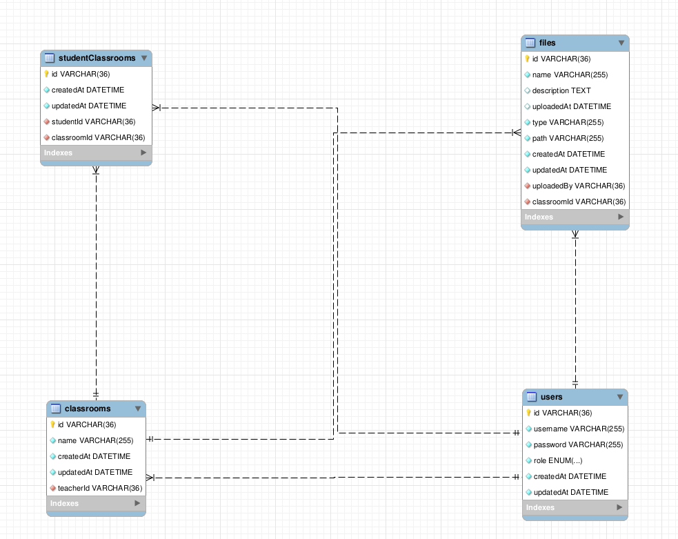

The project is developed using Node.js v14 and Mysql v5.7.

Below are the steps to run this project:

- download the project zip
- unzip the file
- run npm install
- replace the mysql config variables under the file ./config/config.js
- run node app.js (This command will create the database and all the required tables and then start the app server)
- run ./config/create-users.js (This command will create 4 users with the role of teacher and 10 users with the role of student. All the users have the same password - which is password only)

##### ER Diagram:

